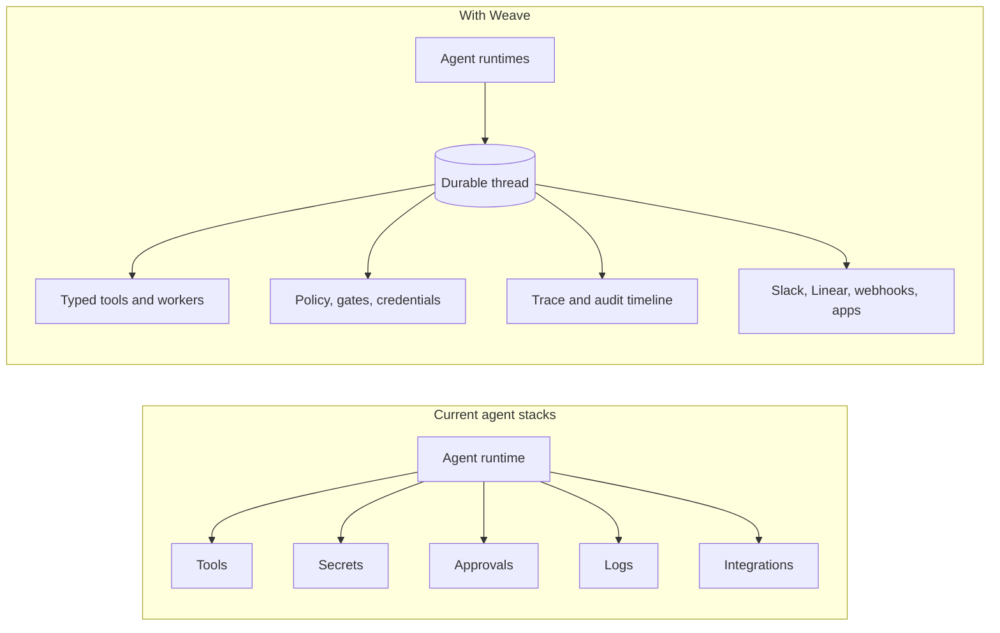
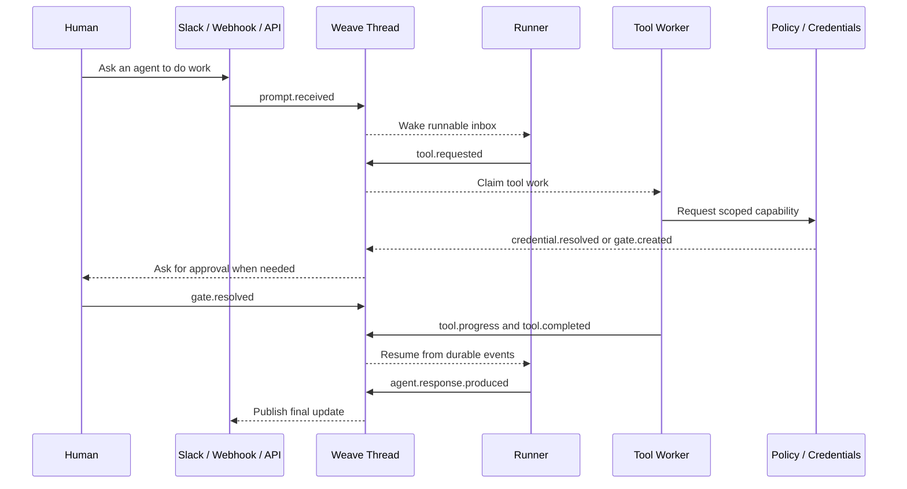

# What Is Weave?

Weave is the durable control plane for agents.

It gives agent systems a stable thread of record: one place where prompts, decisions, tool calls, approvals, credentials, progress, interruptions, and outcomes become durable events. Agent runtimes can stop, move, or change. Tools can run asynchronously. Humans can step in. The thread remains the source of truth.

## The Problem

Agent products are moving from demos to real work. That changes the failure mode.

In a demo, an agent can be a live process with a prompt, a few tools, and some optimistic state. In production, that is not enough. Teams need to know what happened, why it happened, who approved it, which credentials were used, where it paused, and how it safely resumes when compute disappears.

Most teams are rebuilding the same missing layer in fragments:

- custom tool wrappers
- ad hoc approval flows
- partial traces
- fragile retries
- runtime-specific memory
- one-off Slack, webhook, and dashboard integrations

Weave turns that missing layer into a shared primitive.

## Where Weave Fits

Weave does not try to replace every runtime, workflow engine, event store, or policy system. It gives them one durable boundary to meet at.

## The Core Idea

The runtime is ephemeral. The thread is durable.

A Weave thread records the meaningful facts of an agent session:

- what started the work
- what the agent decided
- which tools it requested
- how those tools progressed
- what policies and credentials applied
- where a human approved, denied, or redirected the work
- how the system resumed after waiting, crashing, or moving runtimes

That event boundary makes agents easier to operate, audit, and trust without forcing teams into one agent framework.

## What Weave Unlocks

- Resumable agents that continue from durable state, not process memory.
- Safer tools that expose typed requests, progress, completion, and failure.
- Human-in-the-loop workflows that are part of the model, not exceptions.
- Credential mediation that gives workers scoped access without handing raw secrets to the reasoning runtime.
- Unified traces that connect prompts, decisions, tool calls, approvals, and results.
- Runtime portability so teams can wrap OpenCode-like, Codex-like, Claude Code-like, LangGraph-like, custom, local, or hosted agents behind the same thread model.
- Incremental adoption because existing engines and integrations can plug in behind the thread.

## How It Works

The important part is not the database, queue, model, or runtime chosen first. The important part is the durable contract: every meaningful action crosses the thread boundary as an event.

## Why Now

Agents are about to touch more systems than ordinary automation did: observability, deploys, code, browsers, customer data, internal tools, and production infrastructure. The more capable they become, the less acceptable it is for their control plane to live inside an opaque runtime loop.

The next generation of agent systems will need to be:

- durable
- observable
- interruptible
- policy-aware
- credential-safe
- integration-friendly
- portable across runtimes

Weave is built for that shape from the beginning.

## The Vision

Weave should become the open event and control substrate for agent systems.

Developers should be able to bring the runtime, model, tools, storage engine, policy provider, and integrations they already use, then coordinate them through one thread model. Operators should be able to inspect a session after the fact and understand exactly what happened. Humans should be able to approve, pause, deny, or redirect agent work without breaking the execution model.

The near-term goal is narrower: prove that one durable thread can coordinate agent reasoning, async tool work, human approval, scoped credentials, and resumable execution end to end.

If that works, the bigger platform becomes obvious.

## The Short Version

Weave is what agent systems need when they stop being demos.

It is the durable place where agent work becomes inspectable, resumable, governable, and safe to connect to the real world.
